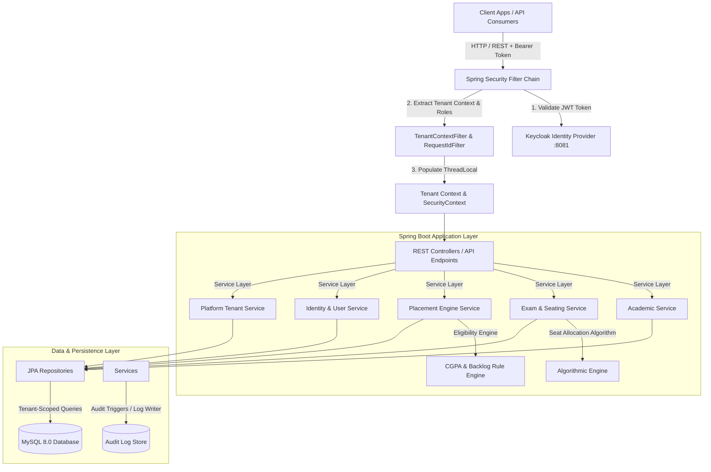
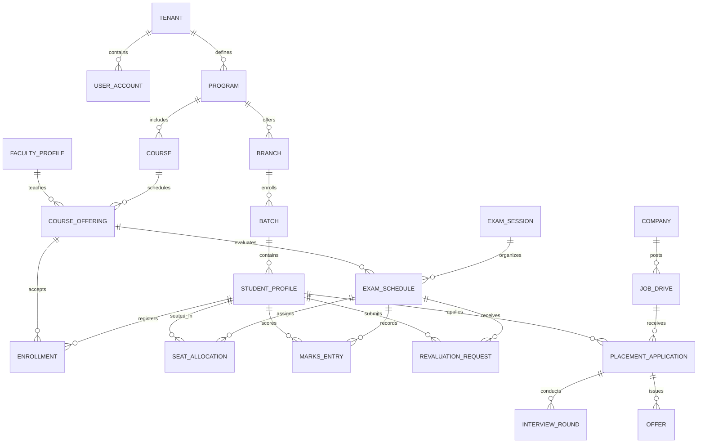
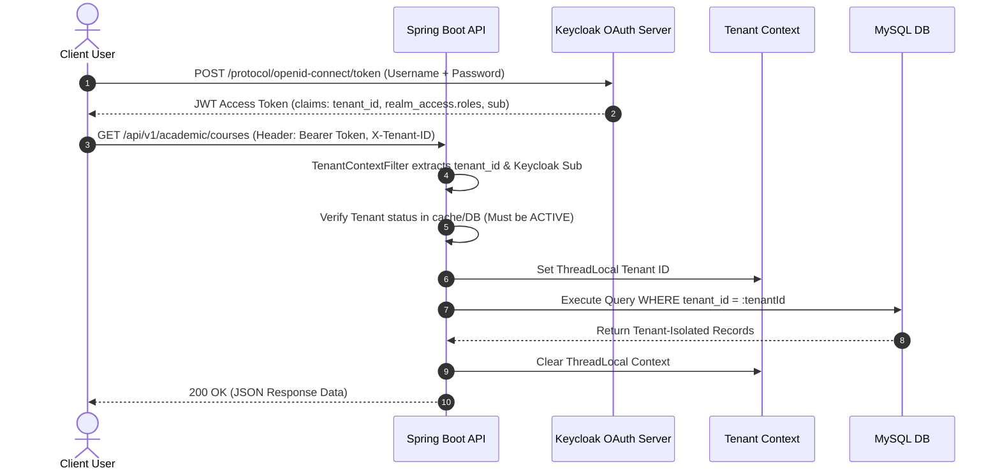

# 🏛️ Multi-Tenant College Administration ERP Platform

[](https://spring.io/projects/spring-boot)
[](https://www.oracle.com/java/)
[](https://www.keycloak.org/)
[](https://www.mysql.com/)
[](https://flywaydb.org/)
[](https://www.docker.com/)
[](http://localhost:8080/swagger-ui.html)

A production-ready, enterprise-grade multi-tenant backend system for Higher Education College Management, focusing on **Academic Operations**, **Automated Examination & Seating Management**, **Placement Drive & Eligibility Engine**, and **Keycloak IAM Integration** with strict tenant isolation and Role-Based Access Control (RBAC).

---

## 📋 Table of Contents

- [Architectural Overview](#-architectural-overview)
  - [System Architecture](#system-architecture)
  - [Entity Relationship Diagram](#entity-relationship-diagram)
  - [Multi-Tenant Request Lifecycle](#multi-tenant-request-lifecycle)
- [Key Features & Modules](#-key-features--modules)
  - [1. Multi-Tenancy & Platform Administration](#1-multi-tenancy--platform-administration)
  - [2. Keycloak IAM & Role-Based Access Control (RBAC)](#2-keycloak-iam--role-based-access-control-rbac)
  - [3. Academic Management System (AMS)](#3-academic-management-system-ams)
  - [4. Exam Management System (EMS) & Seating Algorithm](#4-exam-management-system-ems--seating-algorithm)
  - [5. Placement Management Engine & Eligibility Verification](#5-placement-management-engine--eligibility-verification)
  - [6. Audit Logging & Compliance](#6-audit-logging--compliance)
- [Security & RBAC Matrix](#-security--rbac-matrix)
- [API Endpoint Catalog](#-api-endpoint-catalog)
- [Getting Started & Local Setup](#-getting-started--local-setup)
  - [Prerequisites](#prerequisites)
  - [1. Infrastructure Setup via Docker Compose](#1-infrastructure-setup-via-docker-compose)
  - [2. Keycloak Realm Setup & Test Credentials](#2-keycloak-realm-setup--test-credentials)
  - [3. Running the Backend Service](#3-running-the-backend-service)
  - [4. Verification & Smoke Testing](#4-verification--smoke-testing)
- [Environment Configuration](#-environment-configuration)
- [Automated Testing Strategy](#-automated-testing-strategy)
- [Directory & Project Layout](#-directory--project-layout)

---

## 🏗️ Architectural Overview

### System Architecture



### Entity Relationship Diagram



### Multi-Tenant Request Lifecycle



---

## ⚡ Key Features & Modules

### 1. Multi-Tenancy & Platform Administration
- **SaaS Isolation**: Multi-tenant architecture supporting multiple universities/colleges on a single deployment.
- **Tenant Lifecycle**: Support for tenant creation (`ACTIVE`) and administrative suspension (`SUSPENDED`).
- **Data Protection**: Automatic tenant scoping for all queries preventing cross-tenant data leakage.

### 2. Keycloak IAM & Role-Based Access Control (RBAC)
- **Token Security**: Stateless JWT OAuth2 validation against Keycloak resource server.
- **Hierarchical RBAC**: Supported roles include `PLATFORM_SUPER_ADMIN`, `TENANT_ADMIN`, `ACADEMIC_ADMIN`, `EXAM_CONTROLLER`, `FACULTY`, `HOD`, `STUDENT`, `PLACEMENT_OFFICER`, and `RECRUITER`.
- **Dynamic Role Resolution**: Keycloak client roles mapped to local application permissions.

### 3. Academic Management System (AMS)
- **Hierarchy Structure**: Programs (e.g., B.Tech, M.Tech) → Branches (e.g., CSE, ECE) → Batches (e.g., 2022-2026).
- **Curriculum & Courses**: Course catalog management with semester credits and degree type requirements.
- **Enrollment Tracking**: Course offering registration, student enrollment status tracking, and drop workflows.

### 4. Exam Management System (EMS) & Seating Algorithm
- **Exam Sessions**: Mid-term, End-term, and Supplementary examination session management.
- **Automatic Seating Allocation Algorithm**:
  - Distributes students across venues minimizing adjacent seats for students in the same course.
  - Ensures barred students (due to attendance or disciplinary action) are excluded from seat allocation.
- **Hall Ticket Generation**: Automated hall ticket issuance with bar status enforcement.
- **Grade & Marks Workflow**: Marks entry, automatic grade calculation (A, B, C, D, F), marks locking, and revaluation approval flow.

### 5. Placement Management Engine & Eligibility Verification
- **Recruitment Drives**: Job postings with salary package (LPA), deadline, location, and role specifications.
- **Real-Time Eligibility Engine**:
  - Evaluates student CGPA against `minCgpa`.
  - Verifies active backlog count against `maxBacklogs`.
  - Enforces allowed branch IDs and batch graduation years.
- **Application & Interview Flow**: Full lifecycle tracking: `APPLIED` → `SHORTLISTED` → `INTERVIEW_ROUNDS` → `OFFER_ISSUED` → `ACCEPTED` / `DECLINED`.
- **Placement Analytics**: Aggregated dashboard statistics on total drives, applications, offers, and placement percentage.

### 6. Audit Logging & Compliance
- **Activity Tracking**: Tracks sensitive administrative actions with IP addresses, user IDs, and timestamps.
- **Flyway Versioning**: Structured schema evolution with audit log column tracking.

---

## 🔒 Security & RBAC Matrix

| Role | Platform / Tenants | User Mgmt | Academic Admin | Exam Schedules & Marks | Seating & Hall Tickets | Placement Drives & Offers |
|------|:---:|:---:|:---:|:---:|:---:|:---:|
| **PLATFORM_SUPER_ADMIN** | Full Access | Full Access | Read-Only | Read-Only | Read-Only | Read-Only |
| **TENANT_ADMIN** | Tenant Self | Full Access | Full Access | Full Access | Full Access | Full Access |
| **ACADEMIC_ADMIN** | ❌ | User View | Full Access | View Only | View Only | View Only |
| **EXAM_CONTROLLER** | ❌ | ❌ | View Only | Full Access | Full Access | ❌ |
| **FACULTY** | ❌ | ❌ | Assigned Courses | Enter Marks | View Schedule | ❌ |
| **STUDENT** | ❌ | Profile View | Enrolled Courses | View Marks / Revaluation | View Hall Ticket | Apply & Manage Offers |
| **PLACEMENT_OFFICER** | ❌ | ❌ | View Students | ❌ | ❌ | Full Access |
| **RECRUITER** | ❌ | ❌ | ❌ | ❌ | ❌ | Manage Drives & Applicants |

---

## 🔌 API Endpoint Catalog

### Platform & Tenant APIs
- `GET /api/v1/platform/tenants` — List all registered platform tenants (`PLATFORM_SUPER_ADMIN`)
- `POST /api/v1/platform/tenants` — Onboard a new tenant (`PLATFORM_SUPER_ADMIN`)
- `POST /api/v1/platform/tenants/{id}/suspend` — Suspend tenant operations (`PLATFORM_SUPER_ADMIN`)
- `GET /api/v1/tenants/me` — Retrieve current tenant information (`TENANT_ADMIN`)

### Identity & User Link APIs
- `GET /api/v1/users` — Paginated user directory search (`TENANT_ADMIN`, `ACADEMIC_ADMIN`)
- `POST /api/v1/users` — Link Keycloak user subject to local tenant account (`TENANT_ADMIN`)
- `PUT /api/v1/users/{id}/roles` — Update assigned user roles (`TENANT_ADMIN`)

### Academic Management APIs
- `GET /api/v1/academic/programs` — List academic degree programs
- `POST /api/v1/academic/programs` — Create degree program (`ACADEMIC_ADMIN`, `TENANT_ADMIN`)
- `GET /api/v1/academic/courses` — List courses by program ID
- `POST /api/v1/academic/students` — Register student profile (`ACADEMIC_ADMIN`)
- `POST /api/v1/academic/enrollments` — Enroll student into course offering

### Examination Management APIs
- `POST /api/v1/exams/sessions` — Create exam session (`EXAM_CONTROLLER`)
- `POST /api/v1/exams/schedules/{id}/seats/allocate` — Run seating allocation algorithm (`EXAM_CONTROLLER`)
- `POST /api/v1/exams/schedules/{id}/hall-tickets/generate` — Generate hall tickets (`EXAM_CONTROLLER`)
- `POST /api/v1/exams/schedules/{id}/marks` — Enter course marks (`FACULTY`, `EXAM_CONTROLLER`)
- `POST /api/v1/exams/schedules/{id}/marks/lock` — Lock marks against further edits (`EXAM_CONTROLLER`)
- `POST /api/v1/exams/schedules/{id}/revaluations` — Submit revaluation request (`STUDENT`)

### Placement Engine APIs
- `GET /api/v1/placements/companies` — List registered hiring partners
- `POST /api/v1/placements/drives` — Create campus placement drive (`PLACEMENT_OFFICER`, `RECRUITER`)
- `GET /api/v1/placements/drives/{id}/eligibility` — Check logged-in student eligibility (`STUDENT`)
- `POST /api/v1/placements/drives/{id}/apply` — Submit drive application (`STUDENT`)
- `POST /api/v1/placements/applications/{id}/rounds` — Add interview round result (`PLACEMENT_OFFICER`, `RECRUITER`)
- `POST /api/v1/placements/applications/{id}/offer` — Issue official placement offer (`PLACEMENT_OFFICER`, `RECRUITER`)
- `POST /api/v1/placements/offers/{id}/accept` — Accept job offer (`STUDENT`)

---

## 🚀 Getting Started & Local Setup

### Prerequisites
- **Java 21 JDK**
- **Apache Maven 3.9+**
- **Docker & Docker Compose**

### 1. Infrastructure Setup via Docker Compose

Spin up MySQL 8.0 and Keycloak 24.0 containers:

```bash
docker compose up -d mysql keycloak
```

Verify services are up and healthy:
- **MySQL 8.0**: `localhost:3306` (Database: `college_admin`, User: `ca_user`, Password: `ca_pass`)
- **Keycloak IAM**: `http://localhost:8081` (Admin User: `admin`, Password: `admin`)

### 2. Keycloak Realm Setup & Test Credentials

The docker container automatically imports the pre-seeded realm from `keycloak/realm-export.json` for realm `college-admin`.

#### Seed Test Users (Tenant: IIIT Bangalore `00000000-0000-0000-0000-000000000001`)

| Username | Password | Assigned Role | Description |
|----------|----------|---------------|-------------|
| `superadmin` | `SuperAdmin@123` | `PLATFORM_SUPER_ADMIN` | Platform Super Administrator |
| `tenantadmin` | `TenantAdmin@123` | `TENANT_ADMIN` | College Admin for IIITB |
| `examcontroller` | `Exam@123` | `EXAM_CONTROLLER` | Exam Department Head |
| `placement` | `Placement@123` | `PLACEMENT_OFFICER` | Placement Cell Head |
| `faculty1` | `Faculty@123` | `FACULTY` | Course Faculty |
| `student1` | `Student@123` | `STUDENT` | Enrolled Student Profile |

#### Requesting an OAuth Access Token via cURL

```bash
curl -X POST "http://localhost:8081/realms/college-admin/protocol/openid-connect/token" \
  -H "Content-Type: application/x-www-form-urlencoded" \
  -d "grant_type=password" \
  -d "client_id=college-admin-api" \
  -d "client_secret=college-admin-api-secret" \
  -d "username=tenantadmin" \
  -d "password=TenantAdmin@123"
```

### 3. Running the Backend Service

Build and launch the Spring Boot backend locally:

```bash
cd backend
mvn spring-boot:run
```

Access Points:
- **REST API Base URL**: `http://localhost:8080`
- **Interactive Swagger UI**: `http://localhost:8080/swagger-ui.html`
- **Actuator Health Endpoint**: `http://localhost:8080/actuator/health`

Alternatively, launch the full stack in Docker containers:

```bash
docker compose up --build
```

### 4. Verification & Smoke Testing

Run the automated live smoke verification script to test authentication, tenant scoping, exam seat allocation, marks submission, placement application, and offer issuance:

```powershell
powershell -ExecutionPolicy Bypass -File scripts/live-smoke.ps1
```

---

## ⚙️ Environment Configuration

Configuration variables can be customized in `.env` or passed via environment variables:

| Environment Variable | Default Value | Description |
|----------------------|---------------|-------------|
| `MYSQL_URL` | `jdbc:mysql://localhost:3306/college_admin?...` | MySQL JDBC Connection String |
| `MYSQL_USER` | `ca_user` | MySQL Database Username |
| `MYSQL_PASSWORD` | `ca_pass` | MySQL Database Password |
| `KEYCLOAK_ISSUER_URI` | `http://localhost:8081/realms/college-admin` | Keycloak Issuer URI for JWT Validation |
| `KEYCLOAK_ADMIN` | `admin` | Keycloak Admin Console Username |
| `KEYCLOAK_ADMIN_PASSWORD` | `admin` | Keycloak Admin Console Password |

---

## 🧪 Automated Testing Strategy

The repository includes **102 automated tests** featuring unit, integration, and security tests:

```bash
cd backend
mvn verify
```

### Test Coverage Highlights:
- **Algorithmic Unit Tests**:
  - `SeatAllocationAlgorithmTest`: Verifies seating distribution rules and non-adjacent student placement.
  - `EligibilityEngineTest`: Validates CGPA, backlog, and branch eligibility evaluation logic.
  - `GradeCalculatorTest`: Verifies marks-to-grade mapping logic.
- **Security & RBAC Matrix Tests**:
  - `RbacMatrixIT` & `ComprehensiveRbacIT`: Tests every role against all API endpoint families ensuring strict 403 Forbidden enforcement for unauthorized roles.
  - `TenantIsolationIT`: Verifies cross-tenant data isolation and 404/403 responses when attempting cross-tenant access.
- **End-to-End System Flow Tests**:
  - `ExamPlacementFlowIT`: Full lifecycle verification from academic enrollment → exam creation → seating allocation → hall ticket generation → marks entry & lock → placement drive creation → eligibility check → application → interview rounds → offer issuance & acceptance.

---

## 📁 Directory & Project Layout

```
CA/
├── .env.example                       # Reference environment variables
├── .gitignore                          # Git exclude specifications
├── README.md                           # Master project documentation
├── docker-compose.yml                  # Infrastructure Orchestration (MySQL, Keycloak, Backend)
├── keycloak/
│   └── realm-export.json              # Keycloak seed configuration & clients
├── scripts/
│   ├── live-smoke.ps1                 # Automated PowerShell live smoke test script
│   ├── verify.ps1                     # Local environment check script (PowerShell)
│   └── verify.sh                      # Local environment check script (Bash)
└── backend/
    ├── Dockerfile                     # Multi-stage Docker build file
    ├── pom.xml                        # Maven dependency configuration
    └── src/
        ├── main/
            ├── java/in/ac/iiitb/ca/
            │   ├── CollegeAdminApplication.java
            │   ├── academic/          # Programs, Branches, Courses, Enrollments
            │   ├── common/            # Tenant Context, Global Error Handling, Audit
            │   ├── config/            # OpenAPI / Swagger configuration
            │   ├── exam/              # Sessions, Schedules, Seating, Marks, Revaluation
            │   ├── identity/          # Keycloak User Account Linkage & Roles
            │   ├── placement/         # Placement Drives, Eligibility Engine, Offers
            │   ├── security/          # Keycloak JWT Security Filter Chain & RBAC
            │   └── tenant/             # Platform Tenant Management
            └── resources/
                ├── application.yml    # Main configuration
                ├── application-docker.yml
                ├── application-prod.yml
                └── db/migration/      # Flyway SQL schema scripts (V1, V2)
        └── test/
            ├── java/in/ac/iiitb/ca/   # Integration & Unit test suite
            └── resources/             # Test-specific configurations & Testcontainers setup
```

---

## 📜 License & Acknowledgments

Developed as an Enterprise College Administration SaaS ERP Platform for higher educational institutions.
