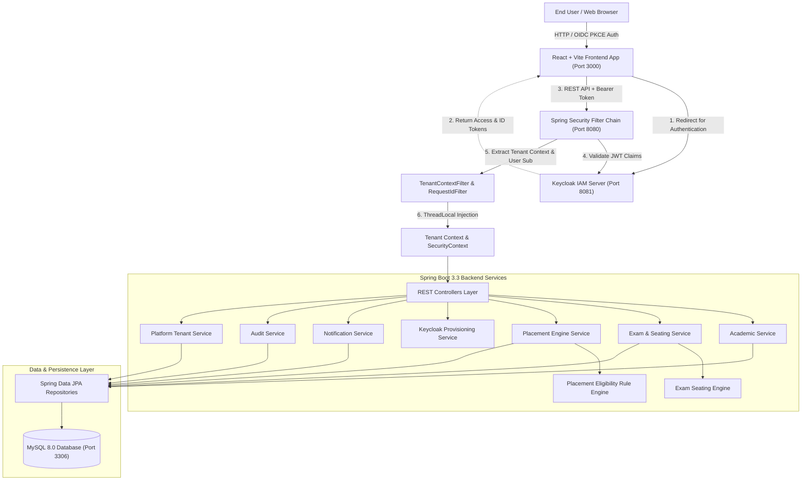
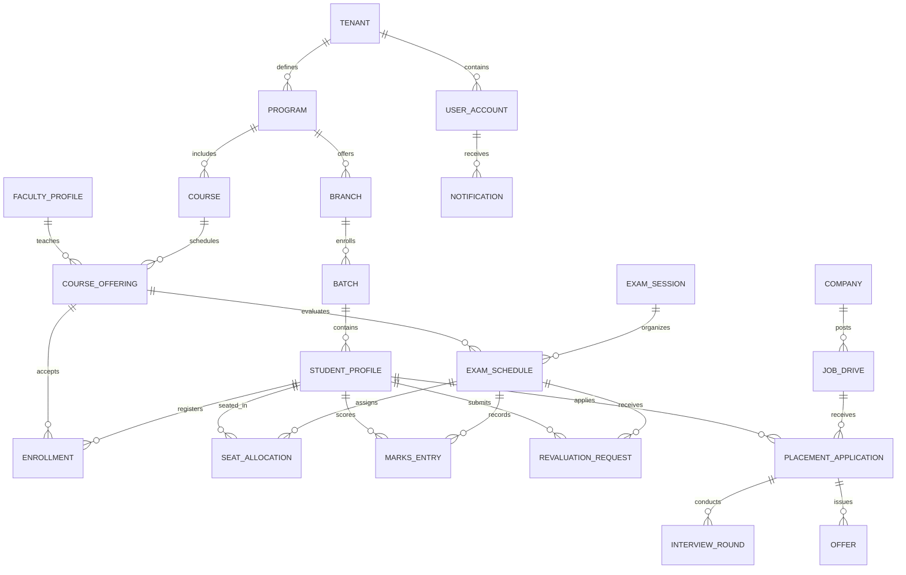
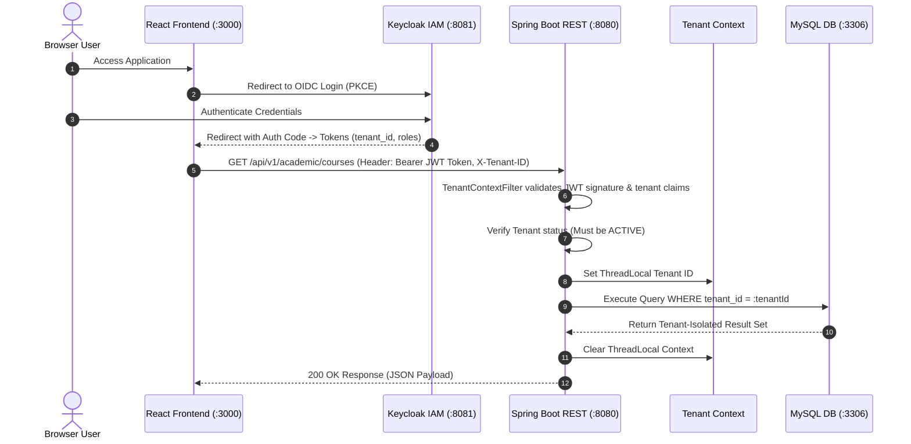

# Multi-Tenant College Administration ERP Platform

[](https://spring.io/projects/spring-boot)
[](https://react.dev/)
[](https://vitejs.dev/)
[](https://www.oracle.com/java/)
[](https://www.keycloak.org/)
[](https://www.mysql.com/)
[](https://flywaydb.org/)
[](https://www.docker.com/)
[](http://localhost:8080/swagger-ui.html)

A production-ready, full-stack enterprise multi-tenant ERP platform for Higher Education Institutions. Featuring a **Spring Boot REST Backend**, a **React + Vite Single Page Application (SPA)**, **Keycloak IAM OIDC Auth (PKCE & Resource Server)**, **Automated Seating & Grade Calculation**, **Real-Time Placement Eligibility Engine**, **In-App Notification Center**, **Keycloak User Auto-Provisioning**, and **Multi-Tenant Isolation**.

---

## Table of Contents

- [Architectural Overview](#architectural-overview)
  - [Full-Stack System Architecture](#full-stack-system-architecture)
  - [Entity Relationship Diagram](#entity-relationship-diagram)
  - [Multi-Tenant OAuth2 OIDC Request Lifecycle](#multi-tenant-oauth2-oidc-request-lifecycle)
- [Key Features & Modules](#key-features--modules)
  - [1. Single Page Application (React + Vite UI)](#1-single-page-application-react--vite-ui)
  - [2. Multi-Tenancy & Platform Administration](#2-multi-tenancy--platform-administration)
  - [3. Keycloak IAM & Automatic User Provisioning](#3-keycloak-iam--automatic-user-provisioning)
  - [4. Academic Management System (AMS)](#4-academic-management-system-ams)
  - [5. Exam Management System (EMS) & Seating Algorithm](#5-exam-management-system-ems--seating-algorithm)
  - [6. Placement Engine & Real-Time Eligibility Rule Engine](#6-placement-engine--real-time-eligibility-rule-engine)
  - [7. In-App Notification Center](#7-in-app-notification-center)
  - [8. Audit Logging & Compliance](#8-audit-logging--compliance)
- [Security & RBAC Matrix](#security--rbac-matrix)
- [API Endpoint Catalog](#api-endpoint-catalog)
- [Getting Started & Local Setup](#getting-started--local-setup)
  - [Prerequisites](#prerequisites)
  - [1. Quick Start via Docker Compose](#1-quick-start-via-docker-compose)
  - [2. Running Backend & Frontend Locally](#2-running-backend--frontend-locally)
  - [3. Test Credentials & Keycloak Access](#3-test-credentials--keycloak-access)
  - [4. Automated QA & Verification Scripts](#4-automated-qa--verification-scripts)
- [DevOps & Automation Utilities](#devops--automation-utilities)
- [Documentation Hub](#documentation-hub)
- [Directory & Project Layout](#directory--project-layout)

---

## Architectural Overview

### Full-Stack System Architecture



### Entity Relationship Diagram



### Multi-Tenant OAuth2 OIDC Request Lifecycle



---

## Key Features & Modules

### 1. Single Page Application (React + Vite UI)
- **Modern UI**: Full-fledged single page application built with React 18, Vite, and custom CSS design system.
- **Keycloak OIDC Integration**: Uses `keycloak-js` for silent token refresh, PKCE login flow, and automatic role checking.
- **Role-Based Navigation**: Responsive dashboard layout (`AppShell`) displaying navigation links tailored strictly to user roles (e.g., Tenants, Users, Academics, Exams, Placements, Notifications, Audit, Settings).
- **Responsive Tables & Pagination**: Pagination components and modals for all administrative operations.

### 2. Multi-Tenancy & Platform Administration
- **Strict Tenant Isolation**: Complete data segregation per institution using ThreadLocal context propagation and Flyway DB schema.
- **Tenant Management**: Onboard new colleges (`ACTIVE`) or administrative suspension (`SUSPENDED`).
- **Automated Bootstrapping**: Automatically provisions default tenant admin accounts and core domain defaults upon college registration.

### 3. Keycloak IAM & Automatic User Provisioning
- **Keycloak REST Admin Integration**: `KeycloakAdminClient` manages user listing, creation, and role mapping directly in Keycloak.
- **Automated Provisioning Service**: `ProvisioningService` links Keycloak subjects to local `user_accounts`, automatically creating corresponding `STUDENT_PROFILE` or `FACULTY_PROFILE` entities.
- **Role Hierarchy**: `PLATFORM_SUPER_ADMIN`, `TENANT_ADMIN`, `ACADEMIC_ADMIN`, `EXAM_CONTROLLER`, `FACULTY`, `HOD`, `STUDENT`, `PLACEMENT_OFFICER`, `RECRUITER`.

### 4. Academic Management System (AMS)
- **Academic Hierarchy**: Programs (e.g., B.Tech, M.Tech) → Branches (e.g., CSE, ECE) → Batches (e.g., 2022–2026).
- **Course & Offering Management**: Course catalog with credit definitions, semester numbers, and course offerings assigned to faculty.
- **Enrollment Flow**: Student course registration and drop tracking.

### 5. Exam Management System (EMS) & Seating Algorithm
- **Exam Sessions**: Mid-term, End-term, and Supplementary exam session management.
- **Automated Seating Allocation Engine**: Distributes students across examination venues minimizing adjacent seating for students taking the same exam while excluding barred students.
- **Hall Ticket Issuance**: Automatic hall ticket generation with bar status checks.
- **Grade & Marks Workflow**: Marks entry, automatic grade assignment (A, B, C, D, F), marks locking, and revaluation request workflow.

### 6. Placement Engine & Real-Time Eligibility Rule Engine
- **Campus Placement Drives**: Job postings with CTC (LPA), deadline, location, and role definitions.
- **Real-Time Eligibility Engine**: Evaluates student CGPA (`minCgpa`), active backlogs (`maxBacklogs`), allowed branch IDs, and graduation batch year.
- **Application & Interview Pipeline**: Full lifecycle tracking: `APPLIED` → `SHORTLISTED` → `INTERVIEW_ROUNDS` → `OFFER_ISSUED` → `ACCEPTED` / `DECLINED`.
- **Placement Analytics**: Dashboard metrics for total drives, applications, offers, and placement ratios.

### 7. In-App Notification Center
- **Notification API**: `/api/v1/notifications` endpoint with unread count badges and mark-as-read endpoints.
- **Automated Triggers**: Sends instant in-app alerts upon exam seating allocation, hall ticket issuance, marks locking, and placement offer issuance.

### 8. Audit Logging & Compliance
- **Audit REST Controller**: `/api/v1/audit/logs` allows tenant admins to review all security-sensitive actions with IP addresses, user IDs, and timestamps.

---

## Security & RBAC Matrix

| Role | Platform Tenants | User Mgmt | Academic Admin | Exam Schedules & Marks | Seating & Hall Tickets | Placement Drives & Offers | Audit & Notifications |
|------|:---:|:---:|:---:|:---:|:---:|:---:|:---:|
| **PLATFORM_SUPER_ADMIN** | Full Access | Full Access | Read-Only | Read-Only | Read-Only | Read-Only | System Audit |
| **TENANT_ADMIN** | Tenant Self | Full Access | Full Access | Full Access | Full Access | Full Access | Tenant Audit |
| **ACADEMIC_ADMIN** | X | User View | Full Access | View Only | View Only | View Only | View Notifications |
| **EXAM_CONTROLLER** | X | X | View Only | Full Access | Full Access | X | View Notifications |
| **FACULTY** | X | X | Assigned Courses | Enter Marks | View Schedule | X | View Notifications |
| **STUDENT** | X | Profile View | Enrolled Courses | View Marks / Revaluation | View Hall Ticket | Apply & Manage Offers | In-App Alerts |
| **PLACEMENT_OFFICER** | X | X | View Students | X | X | Full Access | View Notifications |
| **RECRUITER** | X | X | X | X | X | Manage Drives & Applicants | X |

---

## API Endpoint Catalog

### Platform & Tenant APIs
- `GET /api/v1/platform/tenants` — List registered platform tenants (`PLATFORM_SUPER_ADMIN`)
- `POST /api/v1/platform/tenants` — Onboard a new college tenant (`PLATFORM_SUPER_ADMIN`)
- `POST /api/v1/platform/tenants/{id}/suspend` — Suspend college tenant (`PLATFORM_SUPER_ADMIN`)
- `GET /api/v1/tenants/me` — Retrieve current tenant information (`TENANT_ADMIN`)

### Identity, Provisioning & User APIs
- `GET /api/v1/users` — Paginated user search (`TENANT_ADMIN`, `ACADEMIC_ADMIN`)
- `POST /api/v1/users` — Link Keycloak user to local tenant account (`TENANT_ADMIN`)
- `POST /api/v1/users/provision` — Auto-provision user account with student/faculty profile (`TENANT_ADMIN`)
- `GET /api/v1/users/keycloak` — List users from Keycloak admin API (`TENANT_ADMIN`)

### Academic Management APIs
- `GET /api/v1/academic/programs` — List academic degree programs
- `POST /api/v1/academic/programs` — Create degree program (`ACADEMIC_ADMIN`, `TENANT_ADMIN`)
- `GET /api/v1/academic/courses` — List courses by program ID
- `POST /api/v1/academic/students` — Register student profile (`ACADEMIC_ADMIN`)
- `POST /api/v1/academic/enrollments` — Enroll student into course offering

### Examination Management APIs
- `POST /api/v1/exams/sessions` — Create exam session (`EXAM_CONTROLLER`)
- `POST /api/v1/exams/schedules/{id}/seats/allocate` — Execute seating allocation engine (`EXAM_CONTROLLER`)
- `POST /api/v1/exams/schedules/{id}/hall-tickets/generate` — Generate hall tickets (`EXAM_CONTROLLER`)
- `POST /api/v1/exams/schedules/{id}/marks` — Enter course marks (`FACULTY`, `EXAM_CONTROLLER`)
- `POST /api/v1/exams/schedules/{id}/marks/lock` — Lock marks against edits (`EXAM_CONTROLLER`)
- `POST /api/v1/exams/schedules/{id}/revaluations` — Submit revaluation request (`STUDENT`)

### Placement Engine APIs
- `GET /api/v1/placements/companies` — List registered hiring companies
- `POST /api/v1/placements/drives` — Create campus placement drive (`PLACEMENT_OFFICER`, `RECRUITER`)
- `GET /api/v1/placements/drives/{id}/eligibility` — Evaluate student eligibility (`STUDENT`)
- `POST /api/v1/placements/drives/{id}/apply` — Submit drive application (`STUDENT`)
- `POST /api/v1/placements/applications/{id}/rounds` — Add interview round result (`PLACEMENT_OFFICER`, `RECRUITER`)
- `POST /api/v1/placements/applications/{id}/offer` — Issue official job offer (`PLACEMENT_OFFICER`, `RECRUITER`)

### Notifications & Audit APIs
- `GET /api/v1/notifications` — Retrieve user notifications
- `POST /api/v1/notifications/{id}/read` — Mark notification as read
- `GET /api/v1/audit/logs` — Query tenant audit log entries (`TENANT_ADMIN`, `PLATFORM_SUPER_ADMIN`)

---

## Getting Started & Local Setup

### Prerequisites
- **Java 21 JDK**
- **Node.js 18+ & npm**
- **Apache Maven 3.9+**
- **Docker & Docker Compose**

### 1. Quick Start via Docker Compose

Run the complete full-stack environment (MySQL, Keycloak, Backend API, and React Frontend):

```bash
docker compose up --build -d
```

Access Points:
- **React Frontend Application**: `http://localhost:3000`
- **Spring Boot Backend REST API**: `http://localhost:8080`
- **Swagger Open API Docs**: `http://localhost:8080/swagger-ui.html`
- **Keycloak IAM Admin Console**: `http://localhost:8081` (Admin: `admin` / `admin`)

### 2. Running Backend & Frontend Locally

#### Step A: Infrastructure Containers
```bash
docker compose up -d mysql keycloak
```

#### Step B: Launch Backend
```bash
cd backend
mvn spring-boot:run
```

#### Step C: Launch Frontend SPA
```bash
cd frontend
npm install
npm run dev
```

### 3. Test Credentials & Keycloak Access

Seed users under tenant **IIIT Bangalore** (`00000000-0000-0000-0000-000000000001`):

| Username | Password | Role | Description |
|----------|----------|------|-------------|
| `superadmin` | `SuperAdmin@123` | `PLATFORM_SUPER_ADMIN` | Platform Administrator |
| `tenantadmin` | `TenantAdmin@123` | `TENANT_ADMIN` | College Tenant Admin |
| `examcontroller` | `Exam@123` | `EXAM_CONTROLLER` | Examination Head |
| `placement` | `Placement@123` | `PLACEMENT_OFFICER` | Placement Head |
| `faculty1` | `Faculty@123` | `FACULTY` | Course Faculty |
| `student1` | `Student@123` | `STUDENT` | Enrolled Student Profile |

### 4. Automated QA & Verification Scripts

Run the comprehensive QA suite covering all APIs, role matrix, and live browser flows:

```powershell
powershell -ExecutionPolicy Bypass -File scripts/full-system-qa.ps1
```

Other available scripts:
- `powershell -ExecutionPolicy Bypass -File scripts/ensure-demo-users.ps1` — Auto-provisions test users into Keycloak and DB.
- `powershell -ExecutionPolicy Bypass -File scripts/browser-roles-smoke.ps1` — Validates browser auth tokens across all roles.
- `powershell -ExecutionPolicy Bypass -File scripts/load-test.ps1` — Executes endpoint load testing.
- `powershell -ExecutionPolicy Bypass -File scripts/prod-readiness.ps1` — Runs production readiness checks.

---

## DevOps & Automation Utilities

- **Database Backup**: `powershell -ExecutionPolicy Bypass -File scripts/backup-mysql.ps1`
- **Database Restore**: `powershell -ExecutionPolicy Bypass -File scripts/restore-mysql.ps1`
- **Production Compose Setup**: `docker compose -f docker-compose.prod.yml up --build -d`

---

## Documentation Hub

Detailed documentation is available in the [`docs/`](docs/) directory:

- [**Internship Project Report**](docs/INTERNSHIP_PROJECT_REPORT.md): Complete 500+ line technical project report including background, architectural decisions, multi-tenant isolation mechanics, module specifications, security verification, and performance evaluation.
- [**Production Deployment Guide**](docs/PRODUCTION.md): Production hardening, environment variable configurations, SSL/TLS reverse proxy setup, and database backup strategies.

---

## Directory & Project Layout

```
CA/
├── .env.example                       # Reference development environment variables
├── .env.prod.example                  # Production reference environment variables
├── .gitignore                          # Git tracking rules
├── README.md                           # Master documentation
├── docker-compose.yml                  # Local development orchestration
├── docker-compose.prod.yml             # Production multi-container orchestration
├── docs/
│   ├── INTERNSHIP_PROJECT_REPORT.md   # Comprehensive technical report
│   └── PRODUCTION.md                  # Production deployment guide
├── mysql/
│   └── init/01-databases.sql          # MySQL container bootstrap SQL script
├── keycloak/
│   └── realm-export.json              # Keycloak realm, clients, and role definitions
├── scripts/                            # PowerShell & Python QA and maintenance tools
│   ├── backup-mysql.ps1
│   ├── restore-mysql.ps1
│   ├── ensure-demo-users.ps1
│   ├── browser-roles-smoke.ps1
│   ├── e2e-flow.ps1
│   ├── load-test.ps1
│   ├── prod-readiness.ps1
│   └── full-system-qa.ps1
├── backend/                           # Spring Boot 3.3 REST API
│   ├── Dockerfile
│   ├── pom.xml
│   └── src/
│       ├── main/java/in/ac/iiitb/ca/
│       │   ├── academic/              # AMS module
│       │   ├── common/                # Audit, Notifications, Tenant Context, Errors
│       │   ├── config/                # OpenAPI / Swagger configuration
│       │   ├── exam/                  # EMS & Seating Engine module
│       │   ├── identity/              # Keycloak Admin Client & User Provisioning
│       │   ├── placement/             # Placement & Eligibility Engine module
│       │   ├── security/              # Keycloak JWT Security Filter & RBAC
│       │   └── tenant/                # Platform Tenant Management
│       └── resources/
│           ├── application.yml
│           └── db/migration/          # Flyway SQL migrations (V1, V2, V3)
└── frontend/                          # React 18 + Vite SPA Frontend
    ├── Dockerfile                     # Nginx static deployment Dockerfile
    ├── nginx.conf                     # Production Nginx reverse proxy configuration
    ├── package.json
    ├── vite.config.js
    └── src/
        ├── api/                       # Axios API client & endpoint definitions
        ├── auth/                      # Keycloak JS OIDC PKCE Auth Context & Route Guards
        ├── components/                # Reusable UI components & pagination
        ├── layout/                    # Responsive AppShell navigation dashboard
        ├── pages/                     # Academic, Audit, Exams, Notifications, Placements, etc.
        └── styles/                    # Custom CSS design system
```

---

## License & Acknowledgments

Developed as a Full-Stack Enterprise College Administration SaaS ERP Platform for higher educational institutions.
